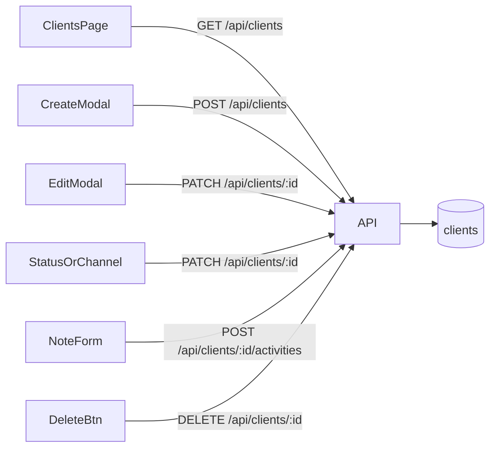

# API de clientes potenciales

Documentación para implementar en el backend NestJS externo el recurso usado por el frontend en **Clientes** (`/dashboard/clientes`).

Fuente de verdad de labels y reglas de negocio: `docs/contrato-backend.md` (sección 8).

## Resumen

| Método | Ruta | Auth | Descripción |
|--------|------|------|-------------|
| `GET` | `/api/clients` | JWT | Lista leads de la empresa. Query opcional `tag` (repetible, OR) |
| `POST` | `/api/clients` | JWT | Crea un cliente potencial |
| `PATCH` | `/api/clients/:id` | JWT | Edición parcial (`name`, `website`, `emails`, `phones`, `tags`, `status`, `contacts`) |
| `DELETE` | `/api/clients/:id` | JWT | Elimina un cliente potencial |
| `POST` | `/api/clients/:id/activities` | JWT | Agrega una nota al timeline |

Los clientes son **por empresa** (compartidos entre usuarios de la misma empresa). Roles `business` y `common`. Admin → 403.

Al crear un lead, cambiar estado o marcar/desmarcar un canal, el backend **añade solo** un evento al timeline. Cambiar `tags` / `emails` / `phones` **no** genera actividad. Las notas las escribe el usuario vía `POST .../activities`.

## Shape de respuesta

```json
{
  "id": "1",
  "name": "Ana Torres",
  "website": "https://anatorres.com",
  "emails": ["ana@anatorres.com", "facturacion@anatorres.com"],
  "phones": ["+34 600 123 456"],
  "tags": ["matriculas"],
  "status": "approved",
  "contacts": {
    "email": true,
    "phone": false,
    "whatsapp": true
  },
  "createdAt": "2026-09-18T09:30:00.000Z",
  "updatedAt": "2026-09-18T10:00:00.000Z",
  "activities": [
    {
      "id": "a1",
      "type": "note",
      "message": "Llamó y pidió propuesta formal.",
      "createdAt": "2026-09-18T10:00:00.000Z",
      "createdByName": "Felipe Segovia"
    }
  ]
}
```

| Campo | Tipo | Descripción |
|-------|------|-------------|
| `id` | `string` | Identificador |
| `name` | `string` | Nombre (obligatorio) |
| `website` | `string?` | URL del sitio |
| `emails` | `string[]` | Correos (máx. 10). Reemplaza el antiguo `email` |
| `phones` | `string[]` | Teléfonos (máx. 10, cada uno 1–64). Reemplaza el antiguo `phone` |
| `tags` | `string[]` | Etiquetas (máx. 20, cada uno 1–40) |
| `status` | `ClientStatus` | Ver estados abajo |
| `contacts` | `{ email, phone, whatsapp }` | Flags booleanos de canales contactados |
| `createdAt` / `updatedAt` | ISO 8601 | Timestamps |
| `activities` | `ClientActivity[]` | Timeline |

### Estados

| Valor | Label |
|-------|-------|
| `not_contacted` | Sin contactar / No contactado |
| `pending` | Pendiente |
| `no_answer` | No contesta |
| `approved` | Aprobado |
| `rejected` | Rechazado |

### Tags

- Lista libre por cliente (sin catálogo).
- Normalización en servidor: trim, minúsculas, espacios internos → guion.
- Patrón: `^[a-z0-9]+(?:-[a-z0-9]+)*$` (ej. `matriculas`, `rondas-app`).
- Deduplicados. En `PATCH`, enviar `tags` reemplaza la lista; omitir no la toca; `[]` la vacía.

### ClientActivity

| Campo | Tipo | Descripción |
|-------|------|-------------|
| `id` | `string` | Identificador |
| `type` | `ClientActivityType` | `created` \| `status_changed` \| `channel_toggled` \| `note` |
| `message` | `string` | Texto mostrado en el timeline |
| `createdAt` | ISO 8601 | Fecha del evento |
| `createdByName` | `string?` | Nombre del autor (notas) |
| `meta` | `object?` | Datos opcionales (p. ej. canal, estado anterior/nuevo) |

## Tipos TypeScript (frontend)

Archivo: `src/shared/types/client.ts`

```typescript
export type ClientStatus =
  | "not_contacted"
  | "pending"
  | "no_answer"
  | "approved"
  | "rejected";
export type ClientContactChannel = "email" | "phone" | "whatsapp";
export type ClientActivityType =
  | "created"
  | "status_changed"
  | "channel_toggled"
  | "note";
```

---

## GET /api/clients

**Auth:** `Authorization: Bearer <JWT>`

**Query:** `tag` repetible. Ej. `?tag=matriculas&tag=rondas-app` → clientes con **al menos uno** de esos tags.

**Response `200`:** `Client[]`

### Errores

| Código | Cuándo |
|--------|--------|
| `401` | Token ausente, inválido o expirado |

---

## POST /api/clients

**Auth:** `Authorization: Bearer <JWT>`

**Body:**

```json
{
  "name": "Ana Torres",
  "website": "https://anatorres.com",
  "emails": ["ana@anatorres.com"],
  "phones": ["+34 600 123 456"],
  "tags": ["matriculas"]
}
```

### Validaciones

| Regla | Error |
|-------|-------|
| `name` obligatorio tras `trim()` | `400` |
| `emails` / `phones` / `tags` opcionales con límites | `400` |
| Estado inicial | siempre `not_contacted` |
| `contacts` inicial | todos `false` |
| Actividad automática | tipo `created` |

**Response `201`:** `Client`

---

## PATCH /api/clients/:id

**Auth:** `Authorization: Bearer <JWT>`

**Body (parcial):**

```json
{
  "status": "pending",
  "emails": ["nuevo@correo.com"],
  "phones": [],
  "tags": ["rondas-app"],
  "contacts": { "email": true }
}
```

Campos opcionales: `name`, `website`, `emails`, `phones`, `tags`, `status`, `contacts` (parcial).

Si vienen `emails` / `phones` / `tags`, **reemplazan** la lista completa. `[]` la vacía. String vacío en `website` → `null`.

### Comportamiento

- Si cambia `status`, añadir actividad `status_changed`.
- Si cambia un flag de `contacts`, añadir actividad `channel_toggled` por cada canal modificado.
- Cambiar solo `emails` / `phones` / `tags` no genera actividad.

**Response `200`:** `Client`

### Errores

| Código | Cuándo |
|--------|--------|
| `400` | Body inválido |
| `401` | Token inválido |
| `404` | Cliente no encontrado |

---

## DELETE /api/clients/:id

**Auth:** `Authorization: Bearer <JWT>`

**Response `204`:** sin body

### Errores

| Código | Cuándo |
|--------|--------|
| `401` | Token inválido |
| `404` | Cliente no encontrado |

---

## POST /api/clients/:id/activities

**Auth:** `Authorization: Bearer <JWT>`

**Body:**

```json
{
  "message": "Llamó y pidió propuesta formal."
}
```

### Validaciones

| Regla | Error |
|-------|-------|
| `message` no vacío tras `trim()` (1–5000) | `400` |

Crea actividad tipo `note` con `createdByName` del usuario autenticado.

**Response `201`:** `Client` (cliente actualizado con la nueva actividad)

### Errores

| Código | Cuándo |
|--------|--------|
| `400` | Mensaje vacío |
| `401` | Token inválido |
| `404` | Cliente no encontrado |

---

## Frontend (referencia)

| Pieza | Ubicación |
|-------|-----------|
| Tipos | `src/shared/types/client.ts` |
| Servicios | `src/shared/services/get-clients.ts`, `create-client.ts`, `update-client.ts`, `delete-client.ts`, `create-client-activity.ts` |
| Hooks | `src/shared/hooks/useClients.ts`, `useClientMutations.ts` |
| Página | `src/pages/ClientsPage/` |
| MSW | `src/mocks/handlers/clients.ts`, `src/mocks/data/clients.ts` |

## Flujo de datos


