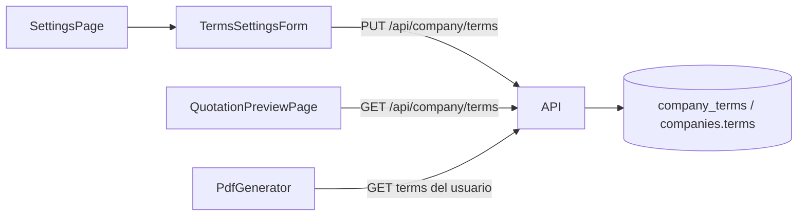

# API de términos y condiciones de empresa

Documentación para implementar en el backend NestJS externo el recurso usado por el frontend en **Configuración → Términos y condiciones** y en la **previsualización de cotizaciones**.

## Resumen

| Método | Ruta | Auth | Descripción |
|--------|------|------|-------------|
| `GET` | `/api/company/terms` | JWT | Obtiene los términos configurados por el usuario autenticado |
| `PUT` | `/api/company/terms` | JWT | Reemplaza la lista completa de términos del usuario |

Los términos son **por usuario** (relación 1:1 con la empresa del usuario, similar a `GET/PUT /api/company`). Se muestran en:

- Previsualización HTML de cotizaciones (`QuotationPreviewPage`)
- PDF generado por el backend (`GET /api/quotations/:id/pdf`)

## Shape de respuesta

```json
{
  "terms": [
    "Forma de pago: 50% al aceptar cotización, 50% al término de implementación.",
    "Los precios están expresados en Pesos Chilenos (CLP).",
    "La validez de esta oferta es de 15 días corridos."
  ],
  "updatedAt": "2026-06-06T12:00:00.000Z"
}
```

| Campo | Tipo | Descripción |
|-------|------|-------------|
| `terms` | `string[]` | Lista ordenada de ítems. Cada elemento es un párrafo/viñeta en el documento |
| `updatedAt` | `string` (ISO 8601) | Fecha de última modificación |

## Tipos TypeScript (frontend)

Archivo: `src/shared/types/terms.ts`

```typescript
export type CompanyTerms = {
  terms: string[];
  updatedAt: string;
};

export type CompanyTermsWriteDto = {
  terms: string[];
};
```

---

## GET /api/company/terms

**Auth:** `Authorization: Bearer <JWT>`

**Response `200`:** `CompanyTerms`

### Comportamiento esperado

- Si el usuario **nunca guardó** términos personalizados, el backend debe responder `200` con la **lista por defecto** (semilla), no `404`.
- La semilla por defecto coincide con `src/shared/data/default-terms.ts` del frontend (6 ítems).

### Errores

| Código | Cuándo |
|--------|--------|
| `401` | Token ausente, inválido o expirado |

---

## PUT /api/company/terms

**Auth:** `Authorization: Bearer <JWT>`

**Content-Type:** `application/json`

**Body:**

```json
{
  "terms": [
    "Forma de pago: 50% al aceptar cotización, 50% al término de implementación.",
    "Los precios están expresados en Pesos Chilenos (CLP)."
  ]
}
```

### Validaciones

| Regla | Error |
|-------|-------|
| `terms` debe ser un array | `400` |
| Cada ítem debe ser `string` | `400` (descartar o rechazar según política; el front envía solo strings) |
| Tras `trim()`, descartar strings vacíos | — |
| Debe quedar **al menos un** término con contenido | `400` |
| El orden del array define el orden en previsualización y PDF | — |

**Response `200`:** `CompanyTerms` (mismo shape que GET)

### Errores

| Código | Cuándo |
|--------|--------|
| `400` | Body inválido o lista vacía tras sanitizar |
| `401` | Token ausente, inválido o expirado |

---

## Implementación sugerida (NestJS)

### Módulo y entidad

Opción A — columna JSON en la tabla `companies`:

```typescript
// company.entity.ts
@Column({ type: 'jsonb', nullable: true })
terms: string[] | null;
```

Opción B — tabla dedicada `company_terms` (1:1 con `companies`):

```typescript
@Entity('company_terms')
export class CompanyTermsEntity {
  @PrimaryGeneratedColumn('uuid')
  id: string;

  @Column({ type: 'uuid', unique: true })
  companyId: string;

  @Column({ type: 'jsonb' })
  terms: string[];

  @UpdateDateColumn()
  updatedAt: Date;
}
```

### DTO de validación

```typescript
import { ArrayMinSize, IsArray, IsString, MinLength } from 'class-validator';

export class UpdateCompanyTermsDto {
  @IsArray()
  @ArrayMinSize(1)
  @IsString({ each: true })
  @MinLength(1, { each: true })
  terms: string[];
}
```

En el servicio, normalizar antes de persistir:

```typescript
const sanitized = dto.terms.map((t) => t.trim()).filter(Boolean);
if (sanitized.length === 0) {
  throw new BadRequestException('Debe enviar al menos un término con contenido');
}
```

### Semilla por defecto

Constante compartida o duplicada en el backend (debe coincidir con el front):

```typescript
export const DEFAULT_COMPANY_TERMS = [
  'Forma de pago: 50% al aceptar cotización, 50% al término de implementación.',
  'Los precios están expresados en Pesos Chilenos (CLP).',
  'La validez de esta oferta es de 15 días corridos.',
  'El soporte premium incluido cubre incidencias de software nivel 1 y 2.',
  'Toda modificación adicional será facturada por separado previa aprobación.',
  'Se requiere firma de contrato de confidencialidad antes del inicio.',
];
```

En `GET`, si no hay registro persistido:

```typescript
return {
  terms: DEFAULT_COMPANY_TERMS,
  updatedAt: company.createdAt.toISOString(), // o fecha fija de seed
};
```

### Controlador

```typescript
@Controller('company/terms')
@UseGuards(JwtAuthGuard)
export class CompanyTermsController {
  constructor(private readonly termsService: CompanyTermsService) {}

  @Get()
  getTerms(@CurrentUser() user: User) {
    return this.termsService.getForUser(user.id);
  }

  @Put()
  updateTerms(@CurrentUser() user: User, @Body() dto: UpdateCompanyTermsDto) {
    return this.termsService.updateForUser(user.id, dto);
  }
}
```

### Integración con PDF

Al generar el PDF (`GET /api/quotations/:id/pdf`), incluir la misma lista de términos del usuario dueño de la cotización, en el mismo orden, con el mismo formato de viñetas que la previsualización HTML.

---

## Frontend (referencia)

| Pieza | Ubicación |
|-------|-----------|
| Servicios | `src/shared/services/get-company-terms.ts`, `save-company-terms.ts` |
| Hook | `src/shared/hooks/useCompanyTerms.ts` |
| Formulario Configuración | `src/shared/components/forms/TermsSettingsForm.tsx` |
| Previsualización | `src/pages/QuotationPreviewPage.tsx` |
| MSW (dev) | `src/mocks/handlers/company.ts` |
| Semilla por defecto | `src/shared/data/default-terms.ts` |

### MSW (desarrollo)

- Handlers en `src/mocks/handlers/company.ts`
- Persistencia en memoria por `userId` del JWT
- Si el usuario no tiene registro, se devuelve `DEFAULT_TERMS`
- `PUT` valida array no vacío y responde `{ terms, updatedAt }`

---

## Flujo de datos


